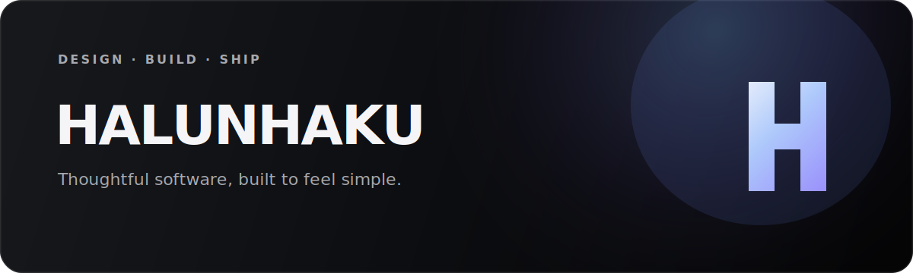

### Thoughtful software, built to feel simple.

把复杂工具做得清晰、安静、好用。

[Website](https://blog.halunhaku.top) · [Projects](https://blog.halunhaku.top/projects) · [Now](https://blog.halunhaku.top/now)

 

I design and build focused web products and browser extensions—from the interface people touch to the infrastructure that keeps everything running.

### Selected work

| | Project | Focus |
| --- | --- | --- |
| 01 | **[MarkTab](https://github.com/halunhaku/marktab)** | A calm, bookmark-first new tab experience |
| 02 | **[ima-extension](https://github.com/halunhaku/ima-extension)** | Fast knowledge capture from the browser |
| 03 | **[Creep Calculator](https://github.com/halunhaku/creep_cal)** | Four engineering models in one clear workflow |
| 04 | **[HALUNHAKU Blog](https://blog.halunhaku.top)** | A personal publishing system built on Cloudflare |

### Working with

`Astro` &nbsp; `TypeScript` &nbsp; `Cloudflare Workers` &nbsp; `Chrome MV3` &nbsp; `Product Design`

---

Currently exploring smaller tools, clearer interfaces, and better ways to work with AI.
